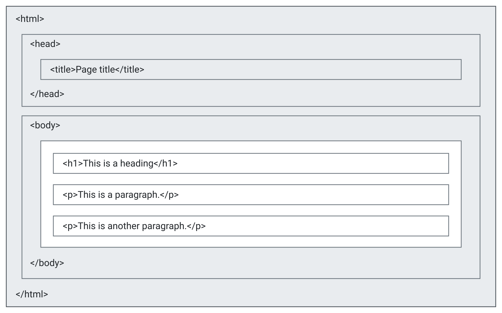

# What is HTML?

- HTML stands for **H**yper **T**ext **M**arkup **L**anguage
- HTML consists of a series of elements
- HTML tell the browser how to display the content
- HTML elements label pieces of content such as:

  - "this is a heading"
  - "this is a paragraph"
  - "this is a link"

In `simple.html`:

- `<!DOCTYPE html>` declaration defines that this document is an HTML5 document
- `<html>` is the root element of and HTML page
- `<head>` contains meta information about the HTML page
- `<title>` title for the HTML page
- `<body>` defines the document's body

  - container for all the visible contents

- `<h1>` defines a large heading
- `<p>` defines a paragraph

# What is an HTML element?

An HTML element is defined by a start tag, some content and an end tag

> `<tagname>` Content goes here ... `</tagname>`

|Start tag|Element content   |End tag|
|:--------|:-----------------|:------|
|`<h1>`   |My first heading  |`</h1>`|
|`<p>`    |My first paragraph|`</p>` |
|`<br>`   |none              |none   |

: Examples of HTML elements {.striped #tbl-exm-elm-html}

::: {.callout-note} 
Some HTML elements have no content (like the `<br>` element). These elements are called empty elements. Empty elements do not have an end tag!
:::

# HTML page structure

Below is a visualization of the HTML page structure:

{#fig-html-page-structure}

In relation to:

```html
<!DOCTYPE html>
<html lang="en">
<head>
    <meta charset="UTF-8">
    <meta name="viewport" content="width=device-width, initial-scale=1.0">
    <title>Page Title</title>
</head>
<body>
    <h1>This is a heading</h1>
    <p>This is a paragraph</p>
    <p>This is another paragraph</p>
</body>
</html>
```

::: {.callout-note}
Only the content inside `<body>` section will be displayed in a browser. The content insdie the `<title>` element will be shown in hte brrower's title bar or in the page's tab.1
:::